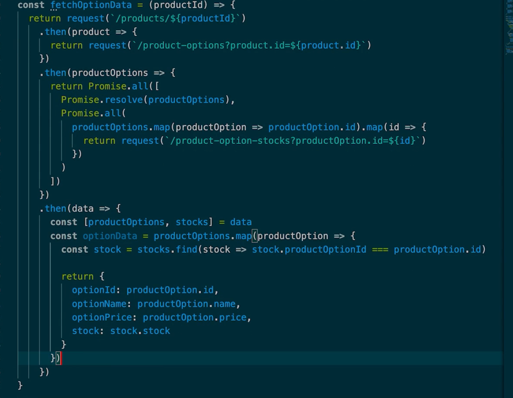
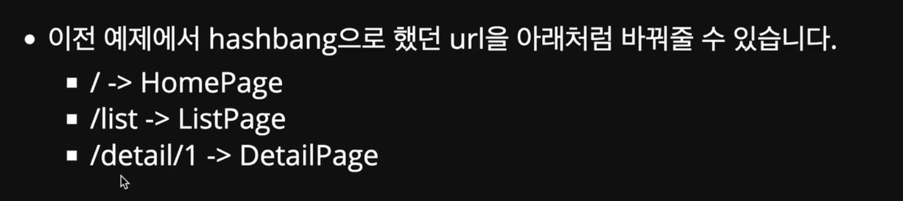

# javascript_study

## 자바스크립트 기본기를 갖추기 위한 LMS 스터디 저장소입니다

8/12 toggle로 선언형 프로그래밍 맛보기<br>
[V]Dom-조작 실습<br>
[V]toggle_button완강<br>

- 이론공부 고민과 해결방안<br>
  이론공부를 하는데, 이해는 어찌어찌 되는데 연결이 안된다. 설명하기가 어렵다. 어떻게 해야할까? 이해의 틀을 짜놓을까? 카테고리별로?
  예를들어 어떤 기술 스택 관련은
  이 기술이 왜 생겼고, 관련기술, 경쟁기술, 선두기술등은 뭐가 있으며, 이 기술만의 강점은 무엇이고, 나는 이걸 왜 배워야 하며,
  이 기술의 단점은 무엇이고, 한계는 무엇이고, 그걸 극복하기 위한 방안은 무엇이고, 요즘의 동향은? 이정도?
  <i>그럼 스코프, 실행 컨텍스트 이런건?
  모여서 하나가 되는 지식은...
  cs는 일단 정처기수준으로</i>

8/13 todolist로 선언형 프로그래밍 더 맛보기<br>
[V]todo list 완강 <br>
[]현업 개발문서 종류 흝어보기<br>
[]브라우저 렌더링 심화(react 사전공부. 2depth로 해보자)
[]ui의 추상화?
장기적 공부목표 : 자바스크립트의 이해와 최적화, React의 이해와 최적화<br>

- form.querySelector(input[name=todo]).value라는 방법으로 폼에서 특정 인풋의 값을 가져왔다. css에서 특정 애트리뷰트 값을 가진 태그를 집어내는 코드인줄은 알고있었는데 querySelector로도 쓸 수 있었다니.

* 강사님이 생성자 함수 코드마다 나누어 설명하신다. 타겟에 컴포넌트를 집어넣는 부분, 컴포넌트 내부 html태그를 생성하는 부분, 컴포넌트의 로직을 다루는 부분. react에서 컴포넌트를 만드는것을 대비해서 알려주시려는 것일까. 이것이 컴포넌트 방식으로 생각하기일까?
* 왜 target을 가져오는지 의문이었는데, target을 가져와서 그 안에 컴포넌트가 들어갈 틀을 만들고, 리렌더링이 되는 부분을 따로 render함수에 담아서 최대한 리렌더링을 줄이기 위함인 것 같다. 바꿔말하면 리렌더링이 되지 않는 정적인 컴포넌트의 경우에는 타겟도, render 함수도 필요없다는 의미겠지. 아니지. this를 쓰고싶을 때는 필요함.
* 컴포넌트마다 의존성을 없애고 각자 할 일만(데이터생성하기, 데이터 투두리스트로 렌더링하기)하도록 하니, 에러 추적이 쉽다.
* 그런데 아직 선언형프로그래밍에 대해 감이 잘 안온다...<br>
  1. 컴포넌트가 들어갈 자리를 잡는다
  2. 그려질 컴포넌트를 일단 그린다
  3. 컴포넌트가 가질 상태를 작성한다.여기서 상태는 ui정보,데이터를 의미한다.
  4. 컴포넌트가 상태를 기반으로 그려지게 바꾼다
  5. 상태를 바꿀 함수를 만든다.<br>
     내가 정의한 선언형 컴포넌트 작성법.
     명령형이라면 얼키고 설켜서 에러잡기도 재사용도 어려웠을듯. 물론 공들여 짜면 다를 수 있겠지만,
     이쪽이 압도적으로 공수가 덜 든다. <br>
     강의 수강 전 먼저 짜본 코드를 보면 한숨만 나온다. react맛 좀 봐봤다고 input?setState? onChange? 바로 코드 난잡해지고 todolist에서 setState만들어서 todoform에 넣어서 의존성 왕창 생기게 만들고. <br>내가 무슨 코드를 짜는지 명확하게 알고 짜야 단단한 코드가 나온다. 이걸 체감하게 된 것 만으로도 값진 시간이다.

8/14 쿠키와 로컬스토리지<br>
로컬스토리지를 이용하면 수십메가의 데이터도 영구적으로 저장이 가능하다. 그런데 이걸 중요한 데이터의 저장소로 쓰기엔 부적절하다. 데이터를 암호화한다고 해도 사용자가 직접 로컬스토리지를 건드리는건 막을 방법이 없다. 애초에 사용자의 브라우저인데 내 서비스 저장소로 쓰겠다고 막는것도 웃기고. 비중요데이터 저장소로 쓰는게 알맞다.

- storage를 다루는 함수를 작성할 때, iife로 작성해서 전역오염을 최소화한다고 하셨다. 전역 오염은 무엇인가? 전역 스코프에 함수나 변수가 너무 많이 선언돼서 의도치 않은 동작을 유발하는 것을 말한다.
  그럼 iife는 어떻게 전역오염을 최소화하나?
  iife는 정의됨과 동시에 실행된다. 이 과정에서 내부에 정의된 변수들은 함수의 스코프 내에서만 유효하다. storage는 요소를 렌더링하지 않고 로컬스토리지를 관리하는 함수만 리턴하기에, 다른 컴포넌트들이 결합도를 낮추기 위해 서로 의존성을 없애는 것처럼 함수 자체의 다른 코드들과의 의존성을 없애기 위해 사용했구나.

8/15 모듈<br>
왜 모듈을 import할 때 구주분해할당을 하나? 가독성이 좋기도 하지만, 차후 번들링 할 때 트리쉐이킹을 하기 위한 작업 중 하나. 이름이 겹치는 경우는 as로 대처
로컬 스토리지를 관리하는 storage 함수를 이전에는 전역오염을 최소화 하기위해 iife로 선언해서 storage라는 네임스페이스만 노출시켰는데, 모듈 방식에선 그럴 필요가 없다. 라고 하신다.
왜 그렇지?
=>es6 모듈은 기본적으로 모듈 스코프이다. 각 모듈 파일이 자체적인 스코프를 지닌다는 뜻이다.
모듈 내에서 선언된 변수와 함수는 해당 모듈 내에서만 접근 가능하다. 따라서 모듈 외부와의 전역 스코프 충돌을 피할 수 있다. iife의 목적인 캡슐화, 스코프 보호를 모두 달성할 수 있다.
그래서 왜 모듈을 사용하나?

- 사용할 함수나 변수를 명시적으로 Import하므로, 사용되지 않는 스크립트 추적이 가능하다.
- script태그로 js파일을 로드하면 순서를 신경써야하는데, import는 순서 무관하다.
- 모듈 스코프를 지원하므로, 전역오염을 방지할 수 있다.
  모듈을 사용하려면?
- 웹서버가 필요하다. 나는 npx serve 이용중. 라이브서버도 있고. 근데 왜 웹서버가 필요하지??

8/17일 fetch api, 컴포넌트의 Render함수, 재고api에 대하여
api를 가져오기 전에, 그 api로 올 Json으로 먼저 ui를 그려본 후에 api에 연결하는 편이 실수가 적다.<br>
컴포넌트의 render함수는 파라미터를 받아선 안된다. 자신의 state만 가지고 렌더링해야함. 외부의 개입 없이. <br>
강사님께서 e커머스 회사에 다니던 시절, 재고 api는 지금 실습중인 fetch api와 다르게 따로 요청을 했다고 하셨다.
실시간 재고 정보를 받아오기 위함이라고.

```
  const createOptionFullName = ({ optionName, optionPrice, stock }) => {
    return `${optionName}${stock > 0 ? `옵션가 ${optionPrice}` : ""} | ${
      stock > 0 ? `재고: ${stock}개` : "재고없음"
    }`;
  };
```

이런 식으로 텍스트 넣는거 신박하네.원래는 option안에 넣을 예정이었지만, 생각보다 텍스트가 복잡해져서 바깥에서 데이터에 맞게 텍스트를 생성하고 집어넣는 식으로 코드를 짯다.
this.render에 매개변수가 들어가면 안된다는 컴포넌트 작성 컨벤션과도 목적이 같다.

promise chain을 이용한 상품 재고정보 불러오기. 이렇게 쓰는구나. 상품 테이블 따로 상품 옵션 테이블 따로 재고 테이블 따로인가?
=>이걸보니까 정규화의 필요성을 알 것도 같다. 전부 같은 테이블에서 정보를 관리하면 옵션 수 만큼 같은 상품의 row가 있을 것이고, 중복된 정보들이 잔뜩 포함되게 될 것이다.<br>

8월 18일. history api, 개발 스타일
브라우저에서 페이지를 로딩하면, 세션 히스토리 라는 것을 갖는다<br>

- 페이지를 이동 할 때 마다 쌓이게 되며, 이를 통해 뒤로가기 시 이전페이저로 가거나, 다시 앞으로 가는 등의 이동이 가능함. stack?
- pushState,replaceState 두 개의 메서드로 화면 이동 없어 현재 url업데이트가 가능.
  - pushState : 세션 히스토리에 새 Url 상태를 쌓는다
  - replaceState : 세션 히스토리에 새 url 상태를 쌓지 않고, 현재 url을 대체한다.
    => 실제 화면 이동이 발생하진 않지만 세션 히스토리에 url을 추가하거나, 바꿀 수 있고 이를 통해 페이지 이동 없이 화면을 다시 그릴 수 있다.
    => 이거 spa잖아
    
    어떤 페이지의 세부 페이지로 들어간다기보다, 다른 페이지로 교체한다는 느낌으로 url을 설계하자.

* history.pushState(state,title,url)
  - state : 세션 히스토리에 새 url을 쌓고, 변경된 히스토리에서 어떤 상태값을 받을 수 있음.
  - title : 동작안함
  - url : 실제로 브라우저 url을 어떻게 바꿀건지. 주 사용 용도가 이것이라, (null, null, "string") 이러는게 일반적
* history.replaceState(state,title,url)
  - state : 세션 히스토리에 새 url을 쌓고, 변경된 히스토리에서 어떤 상태값을 받을 수 있음.
  - title : 동작안함
  - url : 세션 히스토리에서 현재 url과 대체할 url
    a태그를 클릭하거나, location.href로 url을 변경하는것과 다르게, 리로드를 유발하진 않음.
    개발 스타일
    어떤 유저를 클릭해서 해당 유저의 투두리스트데이터를 가져와 렌더링 한다고 하자. 이 때 강사님은 투두리스트json에 맞는 화면부터 그리고, api연동하는 식으로, 바텀업?

8/20 1차 프로젝트 마지막날, spa
spa를 위해 꼭 a태그를 써야하는건 아니지만, 시멘틱을 생각하면 a로 해야한다고 하신다. 
history api에서 신경써야 할 세 가지
pathname으로 보여줄 html 결정하는 route함수,
history api에 state를 쌓고 url을 변경하는 pushState,
뒤로가기를 구현하기위한 전역객체에 popstate이벤트로 route 실행 
이 때 popstate는 브라우저의 뒤로가기 버튼이나, history.back등을 통해서 발생한다(push,replace로는 안됨)
history인터페이스는 브라우저의 세션 기록, 즉 현재 페이즈를 불러온 탭 또는 프레임의 방문 기록을 조작할 수 있는 방법을 제공한다.
* 눈여겨볼 속성
 * history.scrollRestoration : 기록 탐색 시 스크롤 위치 복원 여부 명시. 